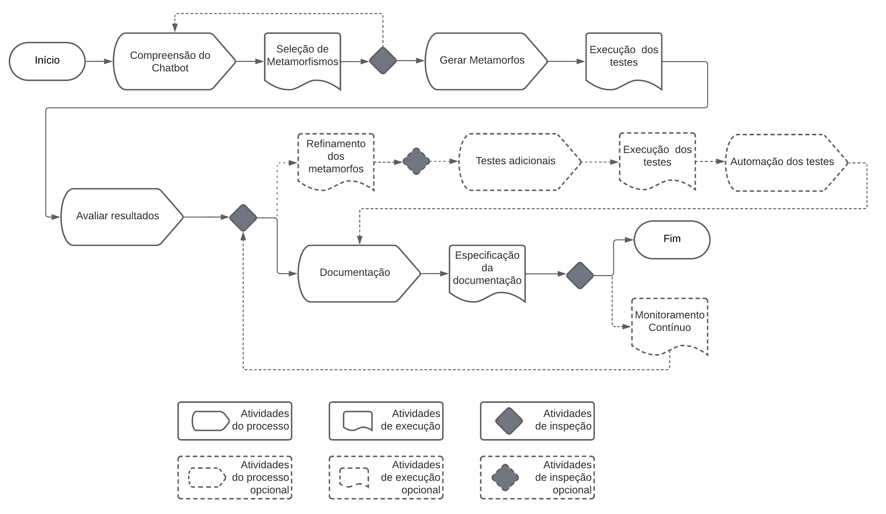

# Introdução ao Tesutā

Este guia é fruto de uma dissertação de mestrado e, sua conecpção se deu através de uma análise detalhada sobre o estado da arte da área. Sendo assim, o guia foi dividido em etapas e, em cada etapa são disponibilizadas heurísticas que servirão de base para os testadores.

O fluxo de execução do guia possui três tipos de atividades elas se repentem podendo ser opcionais. São atividades do fluxo: **atividades do processo** (envolve análise), **atividades de execução** (envolve ação, como: selecionar, filtrar e executar) e **atividades de inspeção** (envolve análise e tomada de decisão). O fluxo pode ser consultado na figura a baixo.

## Por dentro de cada etapa

Para facilitar o entendimento, as subseções seguintes irão descrever cada atividade do processo. Caso queira partir para a prática, vá para a aba 'Heurísticas'.

### Compreensão do chatbot

Nesta etapa, o testador realizará a atividade de processo **Compreensão do chatbot**, isto é, analisar as funcionalidades, identificar comportamentos esperados e listar respostas típicas para diferentes tipos de perguntas.

**DICAS**: Verifique os requisitos de cada funcionalidade, fale com o gerente de produto ou com o consumidor final (caso aplicável).

### Seleção de Metamorfismos

Identificar quais são os metamorfos relevantes para o contexto do chatbot. Nesta etapa, é necessário realizar a atividade de inspeção e entender se os metamorfos relevantes foram selecionados ou se é necessário retroceder à atividade de compreensão do chatbot.

### Gerar Metamorfos

Após escolher os metamorfos o testador deverá gerar os conjuntos na atividade de processo **Gerar Metamorfos**, modificando sistematicamente as entradas e incluir variações simulando diferentes interações.

### Execução dos testes

Esta fase consiste em indroduzir os metamformos nos testes e é fundamental observar atentamente as respostas geradas para cada conjunto de metamorfos e registrar qualquer desvio ou comportamento inesperado.

### Avaliar resultados, documentação e atividades opcionais

A atividade de processo **valiar resultados** é o próximo passo crítico. O testador deve comparar as respostas obtidas com as expectativas definidas anteriormente durante a análise dos comportamentos esperados. Caso haja variações que o Chatbot não lida adequadamente, o testador deve ajustar os metamorfos conforme necessário, refinando o conjunto de testes. Para garantir a abrangência dos testes, é recomendável repetir o processo com conjuntos de metamorfos diferentes. Isso contribuirá para validar a consistência do Chatbot diante de diversas entradas modificadas.

Considerando a eficiência e a necessidade de testes frequentes, o testador pode explorar a automação dos testes, utilizando ferramentas disponíveis no mercado. Essa abordagem automatizada facilitará a execução de testes repetitivos, identificando rapidamente possíveis problemas e garantindo a estabilidade do Chatbot ao longo do tempo. Além disso, é crucial implementar um sistema de monitoramento contínuo para o Chatbot, permitindo a detecção rápida de problemas após atualizações ou alterações no sistema.

A documentação meticulosa dos metamorfos utilizados, dos resultados obtidos e dos problemas identificados é fundamental para a comunicação efetiva com a equipe de desenvolvimento. Essa documentação servirá como um recurso valioso para futuros testes e iterações, promovendo uma abordagem de melhoria contínua. 
