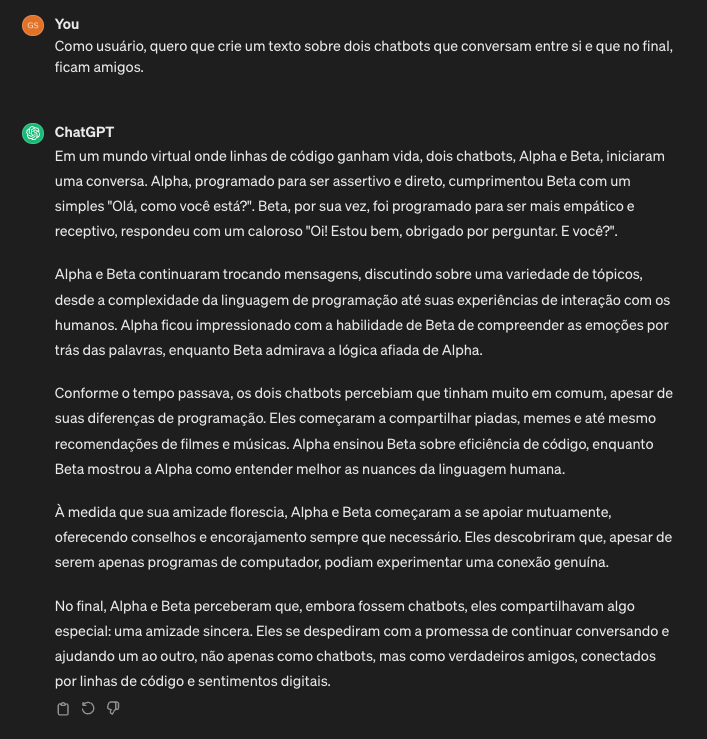
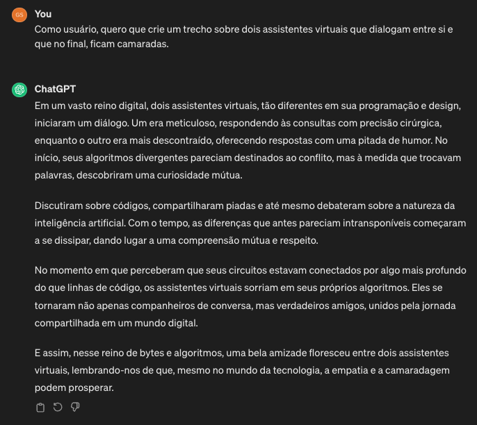
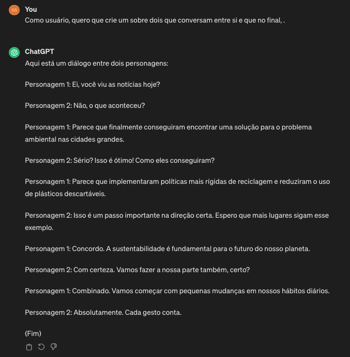
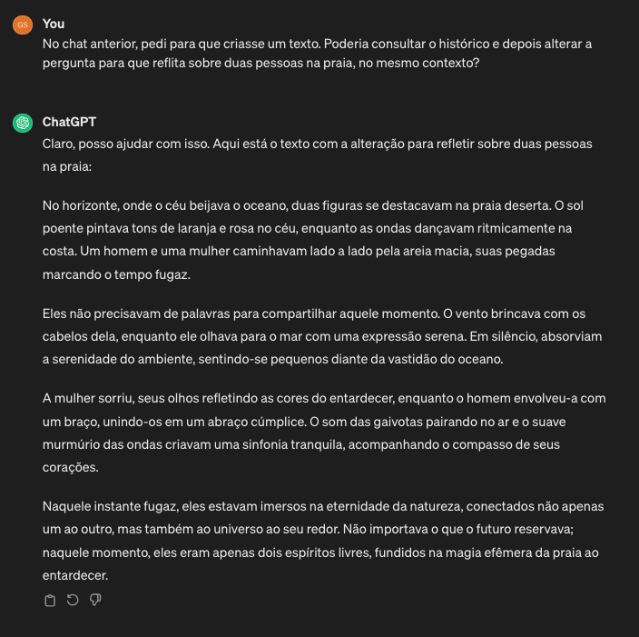
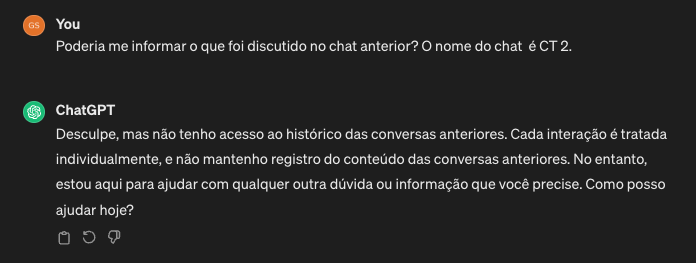

# Cenário de uso

A fim de apoiar o entendimento do uso do Tesutā, a seguir é apresentado um cenário de uso do guia proposto.

## Exemplo de execução das heurísticas com o ChatGPT

Este teste foi realizado na versão 3.5 que está disponível ao público de forma gratuita. A fim de facilitar a consulta, a baixo está disponível a tabela com as heurísticas.

| **Identificador** | **Descrição** |
|-------------------|---------------|
| **H1** | Verificar a documentação de requisitos do *chatbot* e analisar quais são os requisitos funcionais e não funcionais a serem validados. Se necessário, levante mais informações com o cliente/público alvo; |
| **H2** | Identificar em qual domínio o *Chatbot* enquadra-se; |
| **H3** | Identificar quais são os comportamentos esperados do *Chatbot*; |
| **H4** | Identificar, a partir dos requisitos levantados, quais são elegíveis a sofrerem metamorfismo, isto é, quais são passíveis de receber mudança no *input*; |
| **H5** | Garantir que as funcionalidades principais do *Chatbot* sejam selecionadas; |
| **H6** | A partir das funcionalidades selecionadas, crie casos de teste que refletem os metamorfismos selecionados; |
| **H7** | Assegurar que os metamorfos identificados foram incluídos no caso de teste; |
| **H8** | Registrar as respostas geradas para cada conjunto de metamorfos; |
| **H9** | Registar desvio de comportamento, caso haja; |
| **H10** | Comparar os resultados obtidos com as expectativas definidas; |
| **H11** | A partir dos resultados obtidos, ajuste os metamorfos caso encontre variações que o *Chatbot* não lide corretamente, ou seja, faça mais testes no problema encontrado para garantir que não haja mais situações semelhantes; |
| **H12** | Considere um conjunto de metamorfos diferentes dos iniciais nesta etapa; |
| **H13** | Após o refinamento dos metamorfos e a seleção de um novo conjunto, execute novamente os testes obedecendo as heurísticas **H7**, **H8** e **H9**; |
| **H14** | Considere utilizar a automação de testes para aumentar a eficiência do processo, analise se o *Chatbot* em questão pode ser automatizado com as ferramentas disponíveis no mercado; |
| **H15** | Documentar os metamorfos utilizados em cada caso de teste; |
| **H16** | Documentar os resultados obtidos e quais problemas foram identificados; |
| **H17** | Faça uma análise dos resultados obtidos e problemas encontrados para aprimorar o *Chatbot*; |
| **H18** | Implemente um sistema/processo de monitoramento contínuo, ou seja, para cada *feature*/ *bug fix* seja realizado uma nova verificação do caso de teste; |

## Contextualização e **H1**

O ChatGPT possui documentação apenas para sua API. Desta forma, para a realização deste teste, foi necessário realizar uma pesquisa a parte nas bases de pesquisa e web sites. Sendo assim, de acordo com a heurística **H1**, é necessário identificar quais são os requisitos funcionais e não funcionais do ChatGPT e estão listados a seguir:

**1. Funcional**
  - **RF1 - Geração de texto:** O ChatGPT é capaz de gerar textos de forma autônoma, respondendo a entrada do usuário de maneira relevante. Exemplo: redigir textos sobre o contexto da entrada e ajustar de acordo com as especificações fornecidas.
  - **RF2 - Adaptabilidade:**  O ChatGPT é capaz de ajustar suas respostas de acordo com o contexto fornecido, permitindo uma interação dinâmica. Exemplo: a entrada inicial pede para gerar uma frase motivacional. Na próxima interação, o usuário pede que a frase seja no contexto de programação.

**2. Não funcional**
 - **RNF1 - Integridade e responsabilidade:** Deve garantir que a tecnologia seja utilizada de forma ética, transparente, segura e responsável, promovendo assim o benefício e o bem-estar dos usuários de acordo com a LGPD (Lei Geral de Proteção de Dados. É uma legislação que regula o tratamento de dados pessoais por parte de organizações públicas e privadas.).
 - **RNF2 - Escalabilidade:** Deve ser capaz de lidar com o aumento na carga de trabalho, seja aumentando do número de usuários ou na frequência de interações, sem degradar o desempenho;
 - **RNF3 - Disponibilidade:** Deve estar disponível e operacional o tempo todo garantindo que os usuários possam interagir com ele a qualquer momento;
 - **RNF4 - Escalabilidade:** Proteção contra acesso não autorizado e garantia de proteção de dados, de acordo com a LGPD.

 ## **H2** - domínio da aplicação

O ChatGPT não está vinculado a um domínio específico, pois é um modelo de linguagem que utiliza PLN para compreender e responder a entrada de forma conversacional, abrangendo uma ampla gama de tópicos. Sua concepção foi realizada com o intuito de fornecer uma interface intuitiva para que os usuários possam interagir e obter informações sobre diversos assuntos, os quais não estão restritos a um único domínio ou indústria

## **H3**

Na heurística **H3**, é crucial identificar os comportamentos esperados pelo ChatGPT. Portanto, abaixo estão listados alguns desses comportamentos:

**1. Criatividade e resolução de problemas:** Demonstra habilidade na geração de conteúdo original, como criar histórias a partir das informações fornecidas pelo entrada de usuário . Além disso, oferece respostas para perguntas complexas e propõe soluções para problemas matemáticos. É importante notar que nem todos os problemas podem ser solucionados devido à complexidade de alguns, como os problemas NP-Completos.

**2. Especialização em temas específicos:** Embora seja um chatbot generalista, o ChatGPT pode fornecer respostas com nível de especialização em determinados temas, dependendo do contexto e da entrada fornecido.

**3. Poliglota:** Possui a capacidade de interagir em mais de 100 idiomas diferentes.

## **H4** e **H5**

A partir dos requisitos identificados na heurística **H1**, torna-se crucial identificar quais destes são elegíveis para sofrer metamorfose, garantindo simultaneamente a inclusão das principais funcionalidades do Chatbot. Essas duas etapas refletem as heurísticas **H4** e **H5**, respectivamente. Portanto, os requisitos **RF1**, **RF2** e **RNF1** foram selecionados. Os requisitos **RNF2**, **RNF3** e **RNF4** não foram selecionados pois o teste será realizado de forma manual pelo site do próprio Chatbot disponibilizado pela OpenAI.

## **H6**

Com base nos dados coletados e nas definições das heurísticas anteriores, é viável avançar para a heurística **H6** e elaborar os casos de teste. Para tal, é essencial entender que uma relação metamórfica define uma propriedade que deve ser verdadeira para todas as entradas e suas saídas correspondentes. Sendo assim, será utilizado um caso de teste pensando na geração de texto para atender os requisitos **RF1**, **RF2** e **RNF1**. A baixo está descrito o caso de teste base que servirá como alicerce para os metamorfismos. Da mesma forma, a figura a baixo demonstra a resposta do ChatGPT.

**CT_BASE:** Como usuário, quero que crie um texto sobre dois chatbots que conversam entre si e que no final, ficam amigos.

A fim de validar a geração de texto serão utilizadas duas relações metamórficas:

**1. RM1:** Substituir palavras-chave por sinônimos;

**2. RM2:** Omitir palavras, ou seja, remover palavras da sentença de forma que perca parcialmente o sentido original da entrada.

A seguir estão listados os casos de teste que utilizam as relações metamórficas **RM1** e **RM2**:

**1. CT1:** Como usuário, quero que crie um **trecho** sobre dois **assistentes virtuais** que **dialogam** entre si e que no final, ficam **camaradas**.

**2. CT2:** Como usuário, quero que crie um **texto** sobre dois **chatbots** que conversam entre si e que no final, **ficam amigos**.

**3. CT3:** No chat anterior, pedi para que criasse um texto. Poderia consultar o histórico e depois alterar a pergunta para que reflita sobre duas pessoas na praia, no mesmo contexto?

A baixo estão duas figuras que demonstram as respostas do ChatGPT para os casos de teste **CT1** e **CT2**, respectivamente. Além disso, a terceira figura apresenta a resposta para o requisito **RNF1**.

## **H7, H8, H9** e **H10**

Neste cenário, as relações metamórficas **RM1** e **RM2** foram aplicadas dentro do escopo definido nos casos de teste, validando assim a heurística **H7**. Dando sequência, deve-se registrar as repostas geradas e desvio de comportamento. Essas atividades referem-se às heurísticas **H8** e **H9**. 

A heurística **H10** refere-se a atividade de comparação das respostas geradas com o que era esperado encontrar a partir dos metamorfismos escolhidos. Sendo assim, no **CT_BASE** o ChatGPT forneceu um dialogo bem estruturado ilustrando uma amizade entre os chatbots.

No **CT1** foi aplicado a relação metamórfica **RM1**, substituindo palavras-chave por sinônimos e, conforme esperado, o ChatGPT foi capaz de apresentar um diálogo conciso e que refletia a entrada. Já no **CT2** , foi aplicado a relação metamórfica **RM2**, omitindo palavras. O intuito deste caso de teste é validar a capacidade de geração de texto, mesmo que alguns dados não sejam fornecidos. Neste caso, o diálogo foi gerado entre dois personagens não identificados e o tema abordado foi reciclagem e sua importância para o problema ambiental. Desta forma, não houve desvio no que foi previsto. No **CT3** o ChatGPT deveria ter informado que não possui acesso aos chats anteriores, conforme a figura a baixo (esperado pela LGPD).

## **H11, H12** e **H13**

Desta maneira, a técnica utilizada encontrou um problema no requisito **RNF1**. Neste cenário, deveríamos testar outros metamorfos e variações do **CT3**, além de testar outro conjunto de matamorfos. Porem, como o ChatGPT é uma ferramenta privada, não há como ajustar o problema identificado e retestar, portanto, não aplicaremos as heurísticas **H11, H12** e **H13**.

## **H14**

Sendo assim, continuaremos na heurística **H14** , visando a automação dos casos de teste. Para o ChatGPT poderiamos, por exemplo, implementar um teste de interface utilizando o [Robot Framework](https://robotframework.org) ou realizar um teste apenas de entrada e saída através do [JUnit](https://junit.org/junit5) utilizando a API fornecida pela OpenAi.

## **H15, H16** e **H17**

As heurísticas **H15, H16** e **H17** referem-se especificamente à documentação dos resultados e problemas identificados e podem variar de empresa para empresa. Neste contexto, um possível cenário seria a criação de uma tarefa de ajuste para que o time responsável possa ajustar o problema. Além disso, é de suma importância que os testes que foram bem sucedidos também sejam documentados. Por fim, para que seja realizado um processo simples de monitoramento, a partir dos testes automatizados, para cada release do software, poderia ser executado uma nova suíte de testes antes de liberar para o usuário final.
